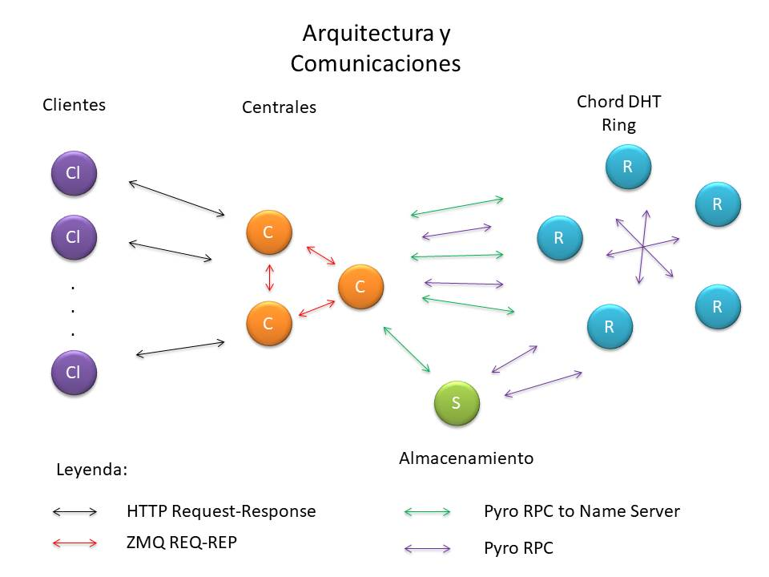

# DistScrappy

**DistScrappy** permite realizar el llamado scrapping de la web de manera distribuída. Su función actual es descargar las URLs de las páginas web hasta diferentes niveles. Se basa en una implementación de una Distributed Hash Table (DHT) usando el protocolo Chord.

## Uso básico

### Virtualenv

Para mayor comodidad, seguridad y evitar posibles fallas a la hora de correr el programa se recomienda crear un entorno virtual.

#### Creando un entorno virtual

<https://virtualenvwrapper.readthedocs.io/en/latest/>

```console
foo@bar:-$ pip install virtualenvwrapper
...
$ export WORKON_HOME=~/Envs
$ mkdir -p $WORKON_HOME
$ source /usr/local/bin/virtualenvwrapper.sh
```

#### Instalando los requerimientos

```console
foo@bar:-$ mkvirtualenv env1
...
(env1)foo@bar:-$ pip install -r requirements.txt
```

### DistScrappy simple

Todo en uno. Se recomienda solo cuando solo importe el funcionamiento del sistema, para mejor debugueo usar la versión modular presentada luego.


Abra un terminal y escriba:

```console
foo@bar:-$ workon env1
...
(env1)foo@bar:-$ python simple_setup.py
```

> Este comando montará en su computadora la infraestructura necesaria para correr un sistema **DistScrappy** funcional basado en el archivo *config.py*. No posee las ventajas de poder interactuar con los nodos mediante la consola.

### DistScrappy modular

Separado por partes. Mejor tradeoff para debugueo, se puede interactuar con los nodos mediante la consola y los logs están separados por consolas.


Abra un terminal y escriba:

```console
foo@bar:-$ workon env1
...
(env1)foo@bar:-$ python simple_centrals.py
```

> Este comando montará en su computadora los nodos centrales basados en el archivo *config.py*. En la terminal se puede interactuar con los nodos mediante la escritura de comandos simples. Aquí se pueden apagar los servidores para probar la tolerancia a fallas.

Abra un terminal y escriba:

```console
foo@bar:-$ workon env1
...
(env1)foo@bar:-$ python init_storage.py
```

> Este comando montará en su computadorel nodo de almacenamiento basado en el archivo *config.py*. En la terminal se puede interactuar con él mediante la escritura de comandos simples. Aquí apagar para probar la tolerancia a fallas.

Abra un terminal y escriba:

```console
foo@bar:-$ workon env1
...
(env1)foo@bar:-$ python simple_rings.py
```

> Este comando montará en su computadora los nodos trabajadores basados en el archivo *config.py*. En la terminal se puede interactuar con los nodos mediante la escritura de comandos simples. Aquí se puede interactuar con los nodos para pedirle información sobre estos y también se pueden apagar para probar la tolerancia a fallas.

### Consumir DistScrappy

Abra otra terminal y escriba:

```console
foo@bar:-$ workon env1
...
(env1)foo@bar:-$ streamlit run init_streamlit_client.py
```

> Este comando abrirá una página web en donde podrá interactuar con el sistema montado previamente.

#### Notas a tener en cuenta

Utilizamos páginas de sitios nacionales gratuitas, las cuales recomendamos usar para el ahorro de datos.

Las páginas <www.uh.cu> y <www.uci.cu> son páginas bastante vistosas para las pruebas de scrapeo en profundidad las cuales tendran un efecto bastante placentero en el usuario.

Si además marca el checkbox "Show html preview" tendrá un resultado aún más impresionante a la vista.

Tendrá una barra de progreso indicando la cantidad de sitios obtenidos mediante el scrapeo y de estos cuales fueron descargados exitosamente.

El caching mejora nuestro programa ,reduciendo el tiempo de descarga en una décima parte aproximadamente.

También contamos con un sección de tiempo para visualizar mejor el efecto del mismo

#### Estadísticas del Caching
| URL        | Deep Level 1  | Download Time  |Caching Time      |
|------------|---------------|----------------|------------------|
| www.uh.cu  |  149 sites         |  96.6 - 292.7  | 5.1 - 9.8 - 14.4 |
| www.uci.cu |   82 sites         | 149.4 - 158.6  |     3.6 - 4      |
| evea.uh.cu |   13 sites         |     23.2       |     0.2 - 6      |

## Sistema General

### Arquitectura

La arquitectura de **DistScrappy** se conforma principalmente de dos partes. La primera parte consiste en los clientes que consumen el servicio, esta parte es bastante sencilla ya que simplemente se basa en protocolo estándar HTTP. La segunda se divide en dos conjuntos, uno primero de servidores centrales con direcciones bien conocidas por los clientes y un conjunto distribuido de nodos desconocidos por los clientes los cuales se encargan de distribuirse las tareas asignadas al sistema.

### Comunicación

**DistScrappy** usa tres protocolos de comunicación. El primero de estos es HTTP, el cual se usa a la hora de brindar el servicio a los clientes. Otro protocolo es el usado por **zmq** el cual se encarga principalmente de la comunicación entre los nodos centrales del sistema. Por último se encuentra el usado por **Pyro**, es el que más predomina ya que es el encargado de la comunicación nodos centrales-nodos trabajadores, nodos trabajadores-nodos trabajadores, nodo almacenamiento-nodos trabajadores.

Para prevenir errores de comunicación, sobre los mencionados protocolos se crearon otros protocolos para el consumo de estos que se acercan más al necesitado por el sistema. Ejemplos de estos protocolos se pueden observar en *chord.ch_shared.py* donde se muestran funciones para el manejo del nombrado usando múltiples name servers de Pyro. Para aliviar la carga a los name server se implementó un sistema de caché para las direcciones, disminuyendo grandemente los pedidos a los name servers permitiendo la comunicación más directa entre objetos remotos .


### Pipeline

El pipeline natural que siguen los pedidos del sistema en el cliente es el siguiente:

1. Cliente hace el HTTP request de las URLs a los nodos centrales.
2. Los nodos centrales le mandan el pedido a los nodos trabajadores de la DHT mediante un RPC.
3. Los nodos trabajadores localizan el nodo encargado de cada URL.
4. El nodo encargado de cada URL la descarga o devuelve la versión guardada en la caché, mediante el callstack regresa el resultado al nodo que hizo el pedido.
5. Se realiza un HTTP response al cliente con la información deseada.



## Cliente

Es la parte encargada de consumir el servicio, debido a la arquitectura del sistema, requiere que se le pasen las direcciones de los servidores centrales a los cuales puede conectarse para completar sus tareas, las direcciones por defecto se encuentran en *config.py*.

Su princial tarea consiste en pedir URLs al sistema de **DistScrappy**, la comunicación entre el cliente y el sistema se realiza mediante el protocolo HTTP.

### Uso del cliente

Se realizaron tres niveles built-in de consumo:

- Clase: *client.client.DistScrappyClient*, para su uso por otros programas al intanciar la clase.
- Consola: *init_console_client.py*, crea una consola en la cual se puede interactuar con el sistema de forma directa. Para ejecutarlo correr el script según la ayuda brindada por este

```console
foo@bar:-$ python init_console_client.py
```

- Streamlit: *init_streamlit_client*, para poder ver directamente los resultados. Para ejecutarlo correr `streamlit run init_streamlit_client` en una consola.

```console
foo@bar:-$ python init_streamlit_client.py
```

Al usar HTTP es muy fácil consumir el servicio brindado por **DistScrappy** sin el uso explícito de la API brindada, realizando un HTTP request con el formato especificado a la dirección de los servidores.

### Scrapping
El scrapping es realizado por la clase *DistScrappyClient* el cual es utilizado en los programas listos para su uso provistos en **DistScrappy**.

En el scrapping se desea descargar un conjunto de URLs iniciales a una profundidad determinada. Cada una de estas url iniciales constituyen los dominios de url a partir de los cuales scrapear, al pasarle varias URLs al cliente estas conformarán todo el conjunto de dominio de las URLs, permitiendo que hayan vínculos entre descendientes de estos dominios.

Utilizamos **BeautifulSoup** con el parser *lxml* para procesar el HTML recibido y a partir de ahí obtener los enlaces siguientes los cuales también se preprocesan para agregarlos a las URLs de las cuales salieron en caso de ser necesario.

Cada nueva URL es contrastada con una lista de URLs scrapeadas para no repetir descargas.

Este scrapeo es iterativo por tanto en cada paso que se obtienen los siguientes links se actualiza la lista de URLs scrapeadas y se limpia la listas de URLs a pedir al servidor, además de llevar la cuenta del nivel de profundidad del scrapeo.

En caso de ocurrir errores estos son guardados y , al acabar el algoritmo, devueltos junto a los HTMLs descargados


### Formato del cuerpo de Request-Response

El request se hace con el método GET y tiene en el cuerpo un JSON con el siguiente formato:

```json
{
    "urls":["URL1", "URL2", "..."]
}
```

El response del sistema contiene en su cuerpo un JSON con el siguiente formato:

```json
{
    "urls": {
        "URL1": "HTML1",
        "URL2": "HTML2",
        "...": "..."
    },
    "errors":{
        "URL1": "ERROR SCRAPPING URL1",
        "URL1": "ERROR SCRAPPING URL2",
        "...": "..."
    }
}
```

## Servidor

Parte encargada del funcionamiento del sistema distribuido. Su principal tarea es brindar a los clientes los servicios esperados por estos de forma lo más transparente posible.

### Configuración del sistema

En el archivo *config.py* se encuentran las direcciones defecto de los nodos, estos se pueden modificar de acuerdo a dónde se vayan a encuentrar los nodos. Además se encuentran otros parámetros los cuales pueden er modificados de acuerdo las características y necesidades con que se corra el sistema.

### Nombrado

**DistScrappy** posee un sistema de nombrado en la que se guardan las direcciones de los objetos reales asociados a un nombre previamente dado que los identifica en el sistema, ejemplo de los nombres que se guardan son el de los trabajadores del sistema. Para el nombrado de los componentes del sistema distribuido se utliza como base la implementación de name servers de **Pyro4**.

### Sincronización

Debido a que **DistScrappy** utiliza un sistema basado en el tiempo relativo hace falta mantener a los nodos de acuerdo con el tiempo del sistema, para esto se utiliza el algoritmo de Berkeley.

Otros tipos de sincronización son logrados mediante el uso de Locks y llamados RPC como es el caso del nodo de almacenamiento *server.storage.StorageNode*.

### Nodos Centrales *CentralNode*

Para el correcto funcionamiento del sistema al menos uno de estos servidores tiene que estar activo, en caso contrario no será posible la comunicación entre y con el sistema.

Para iniciar los nodos centrales se tienen dos scripts:

- *simple_centrals.py* Crea los servidores especificados en *config.py*.

```console
foo@bar:-$ python simple_centrals.py
```

- *init_central.py* Más general y permite la creación más personalizada de un nodo central, mirar la ayuda en la consola para más información.

```console
foo@bar:-$ python init_central.py
```

Funciones:

- Puente entre los clientes y los nodos encargados de procesar el pedido.
- Servidores de nombrado para el sistema.
- Sincronizar relojes en los nodos trabajadores.

#### Manejo de Request-Response

Para el manejo de los pedidos de los clientes en cada nodo central se crea un servidor HTTP multihilos para su manejo concurrente.

#### Coordinación

Entre los nodos centrales se mantiene un coordinador, el cual es el encargado de realizar tareas de mantenimiento en el sistema como la de sincronización de los name servers y del tiempo en los nodos. Este coordinador es seleccionado mediante el algoritmo Bully y se mantiene vigilancia sobre él para en caso de fallar se reeliga uno nuevo.

#### Nombrado 

Estos nodos son encargados de hostear un name server para proveer del un servicio de nombrado al sistema. Para mantener la consistencia de los name servers periódiamente estos se actualizan mutuamente. 

#### Toleracia a fallas

Al ser una parte clave del sistema es necesario que siempre uno de estos nodos esté activo, para esto se crean varios nodos centrales que pueden trabajar independientemente entre ellos. Estos detectan los nodos centrales que están caídos y toman acción en caso de ser necesario. Ejemplo de lo anterior consiste en que el nodo coordinador se caiga, en este caso al darse cuenta de esto, los nodos centrales restantes vuelven a elegir un coordinador.

Este nodo también se asegura de que el name server que le corresponde siempre este corriendo, ya que esto es vital para el sistema.

### Nodos Trabajadores *RingNode*

Para el correcto funcionamiento del sistema al menos uno de estos nodos tiene que estar activo, en caso contrario no será posible utilizar el sistema ya que no habrá quien realice el trabajo.

Para iniciar los nodos trabajadores se tienen dos scripts:

- *simple_rings.py* Crea los trabajadores especificados en *config.py*

```console
foo@bar:-$ python simple_rings.py
```

- *init_ring.py* Más general y permite la creación más personalizada de un nodo trabajador, mirar la ayida en la consola para más información.

```console
foo@bar:-$ python init_ring.py
```

Funciones:

- Descargar las URLs pedidas.
- Cachear las URLs descargadas.

Estos nodos se basan en el protocolo Chord para crear un sistema en forma de anillo encargado de realizar las tareas previamente dichas. En esta DHT formada se guarda la información necesaria para mantener la validez de los HTML descargados.

#### Descargar

Cada nodo es responsable por descargar las URLs que le corresponde guardar según el hash asignado a este. Así es posible impedir de que más de un nodo esté descargando la misma URL impidiendo que se consuman recursos innecesariamente. En caso de que se pida una URL que está siendo descargada, el sistema lo detecta y devuelve el resultado de la descarga en proceso. Para la descarga se utiliza el módulo **urllib**.

#### Cachear

Al ser los nodos trabajadores nodos pertenecientes a una DHT se salvan los HTML scrappeados en ella. Para la validez de la cache se tiene en cuenta un umbral de tiempo encontrado en *config.py*, si viene un pedido de una URL que se cumpla la condición de validez, el HTML no es descargado y es devuelto inmediatamente.

#### Persistencia

Para que los datos guardados sobrevivan el suceso de caída de un nodo se realizan copias del estado de la DHT en un nodo de almacenamiento. Esto permite la recuperación de información cada vez que se una un nuevo nodo a la tabla. El criterio por el cual se salva el estado de la tabla se cuenta por cantidad de escrituras por nodo, este es configurable en *config.py*.

#### Tolerancia a fallas

La tolerancia a fallas en este caso se tiene que ver de manera colectiva, ya que estos nodos forman parte de un conjunto mayor. Gracias al protocolo Chord no importa que un nodo falle ya que el anillo se arreglará eventualmente con el proceso de estabilización.

Para evitar la partición de los **RingNodes* se tomó la medida forzar la introducción de un nodo aleatorio de la DHT en el anillo correspondiente al nodo que se está estabilizando. Esto conduce a una unión natural entre dos particiones de la DHT en caso de que el anillo insertado se encontraba en otra partición.

### Nodo Almacenamiento *StorageNode*

Este nodo provee la capacidad al sistema de guardar el estado actual de la DHT para tener un backup de los datos en caso de que algún error ocurra en el sistema. Este nodo es opcional para el funcionamiento del sistema.

Para iniciar el nodo se almacenamiento se tiene el script:

- *init_storage.py* Permite la creación del nodo de almacenamiento, mirar la ayida en la consola para más información.

```console
foo@bar:-$ python init_storage.py
```

#### Persistencia

Este nodo guarda en las entradas de la DHT en formato JSON para conservar el estado de la DHT.

#### Consistencia

Para evitar el acceso a varios recursos al mismo tiempo este nodo implementa un sistema de sincronización basado en Locks de Python que permite un acceso seguro a los datos y así mantener la consistencia. 

#### Tolerancia a fallas

En caso de que este nodo falle o simplemente no esté activo los nodos de la DHT tendrán datos que se pueden perder en caso de alguna falla, aunque una vez estos nodos detecten que el nodo está activo salvarán los cambios en este.
